# Database Structure + Cost Field Analysis

This is generated from the current backend schemas/controllers (code-first), not by live DB introspection.

## 1) Tenant Split (Superadmin vs Org DB)

```mermaid
flowchart LR
  SA[(Superadmin DB)] --> ORG[Organization\n(slug, dbName, plan)]
  SA --> SADMIN[SuperAdmin]
  ORG -->|runtime connection by dbName| ODB[(Org DB per tenant)]
```

## 2) Core Org ER Diagram (high-signal entities)

```mermaid
erDiagram
  USER ||--o{ ORDER : creates
  USER ||--o{ STOCK_MOVEMENT : creates
  USER ||--o{ STOCK_TRANSFER : creates_or_completes
  USER ||--o{ STOCK_ADJUSTMENT : creates
  USER ||--o{ PURCHASE_ORDER : creates
  USER ||--o{ GRN : creates_or_approves
  USER ||--o{ PURCHASE_RETURN : creates
  USER ||--o{ CUSTOMER_LEDGER : creates
  USER ||--o{ SUPPLIER_LEDGER : creates
  USER ||--o{ NOTIFICATION : receives

  CATEGORY ||--o{ CATEGORY : parent_child
  BRAND ||--o{ PRODUCT : brand
  CATEGORY ||--o{ PRODUCT : categorized
  UNIT ||--o{ PRODUCT : unit
  BARCODE_TYPE ||--o{ PRODUCT : barcode_type
  TAX_SLAB ||--o{ PRODUCT : product_tax
  PRODUCT ||--o{ PRODUCT : parent_variant

  PRODUCT ||--o{ PRODUCT_STOCK : stock_rows
  WAREHOUSE ||--o{ PRODUCT_STOCK : holds
  PRODUCT ||--o{ STOCK_MOVEMENT : movement
  WAREHOUSE ||--o{ STOCK_MOVEMENT : movement

  WAREHOUSE ||--o{ STOCK_TRANSFER : from_or_to
  PRODUCT ||--o{ STOCK_TRANSFER : transfer_items

  WAREHOUSE ||--o{ STOCK_ADJUSTMENT : adjusted_at
  PRODUCT ||--o{ STOCK_ADJUSTMENT : adjusted_item
  WAREHOUSE ||--o{ ADJUSTMENT_BATCH : batch_warehouse
  PRODUCT ||--o{ ADJUSTMENT_BATCH : batch_items

  CUSTOMER ||--o{ ORDER : places
  WAREHOUSE ||--o{ ORDER : fulfills_from
  PRODUCT ||--o{ ORDER : order_items
  ORDER ||--o{ ORDER_PAYMENT : payments
  ORDER ||--o{ ORDER_RETURN : returns
  CUSTOMER ||--o{ ORDER_RETURN : return_customer
  WAREHOUSE ||--o{ ORDER_RETURN : return_warehouse
  PRODUCT ||--o{ ORDER_RETURN : return_items

  SUPPLIER ||--o{ PURCHASE_ORDER : vendor
  WAREHOUSE ||--o{ PURCHASE_ORDER : inbound_to
  PRODUCT ||--o{ PURCHASE_ORDER : po_items

  PURCHASE_ORDER ||--o{ GRN : receipts
  SUPPLIER ||--o{ GRN : supplied_by
  WAREHOUSE ||--o{ GRN : received_at
  PRODUCT ||--o{ GRN : grn_items

  PURCHASE_ORDER ||--o{ PURCHASE_RETURN : return_doc
  SUPPLIER ||--o{ PURCHASE_RETURN : return_to
  WAREHOUSE ||--o{ PURCHASE_RETURN : return_from
  PRODUCT ||--o{ PURCHASE_RETURN : return_items

  CUSTOMER ||--o{ CUSTOMER_LEDGER : customer_txn
  CUSTOMER ||--o{ CUSTOMER_TOPUP : topups
  PRODUCT ||--o{ CUSTOMER_TIER_PRICE : tier_price

  SUPPLIER ||--o{ SUPPLIER_LEDGER : supplier_txn
  SUPPLIER ||--o{ SUPPLIER_PAYMENT : supplier_payments
  SUPPLIER ||--o{ SUPPLIER_ADJUSTMENT : supplier_adjustments
  PURCHASE_ORDER ||--o{ SUPPLIER_PAYMENT : optional_po_link

  CATEGORY ||--o{ ECOM_SETTINGS : featured_category
  PRODUCT ||--o{ ECOM_SETTINGS : featured_products
```



## 3) Cost-Related Fields: same name, different meaning

### A) Product master cost
- Field: `Product.costPrice`
- Scope: Product-level default/master cost.
- Captured in Add Product UI and product APIs.
- Used in stock valuation report fallback (`quantity * product.costPrice`, else `basePrice`).

### B) Opening stock cost
- Field: `ProductStock.supplierPrice`
- Scope: Warehouse-level opening valuation for a specific SKU in a specific warehouse.
- Captured in Opening Stock UI (`Supplier Price` label) and saved in opening stock APIs.
- Important: current stock valuation/report logic does **not** use `supplierPrice`; it uses `Product.costPrice`.

### C) Procurement transactional cost
- Field: `unitCost` in `PurchaseOrder.items`, `GRN.items`, `PurchaseReturn.items`.
- Scope: Document-line transactional cost.
- Used for PO/GRN/Return totals and supplier ledger impacts.
- Important: approving GRN updates quantity but does not currently update `Product.costPrice` or `ProductStock.supplierPrice`.

## 4) Why confusion can happen later

1. Same "price" naming can represent different layers:
   - Add Product -> `Product.costPrice`
   - Opening Stock -> `ProductStock.supplierPrice`
2. Stock report valuation uses `Product.costPrice`, not opening stock `supplierPrice`.
3. Purchase flows use `unitCost` independently; no automatic sync back to product master or warehouse price.
4. Result: three cost sources can diverge over time (`costPrice`, `supplierPrice`, `unitCost`).

## 5) Practical interpretation today

- Treat `Product.costPrice` as reporting/master default cost.
- Treat `supplierPrice` as optional warehouse-specific opening valuation metadata.
- Treat `unitCost` as authoritative for each procurement transaction document.

## 6) Suggested low-risk alignment

1. Keep Opening Stock UI label as "Supplier Price" to distinguish it from product master cost.
2. Decide one valuation source for stock reports:
   - either keep `Product.costPrice` only, or
   - prefer `ProductStock.supplierPrice` when present.
3. Add a clear policy for GRN approval:
   - keep transactional only, OR
   - update a chosen master cost field (with explicit rule).

---

## Code Evidence (key files)

- Product master cost schema: `backend/src/models/org/Product.js`
- Opening stock warehouse price schema: `backend/src/models/org/ProductStock.js`
- Opening stock write path: `backend/src/controllers/admin/stock.controller.js`
- Purchase/GRN/Return `unitCost` flow: `backend/src/controllers/admin/purchaseOrders.controller.js`
- Stock valuation using product cost: `backend/src/controllers/admin/reports.controller.js`
- Add Product UI cost input: `frontend/src/pages/admin/Products.jsx`
- Opening Stock UI cost input (`supplierPrice`): `frontend/src/pages/admin/StockManagement.jsx`